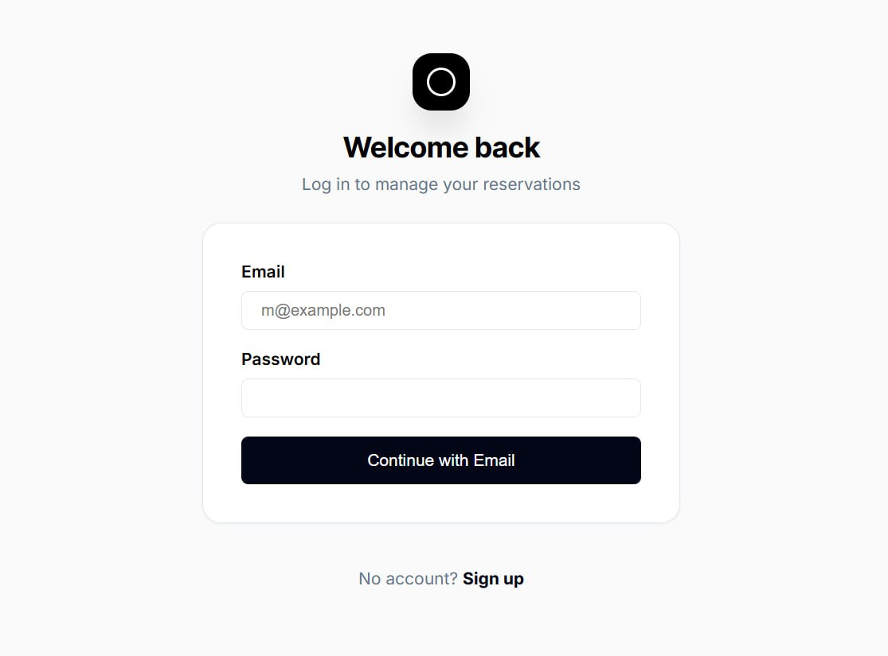
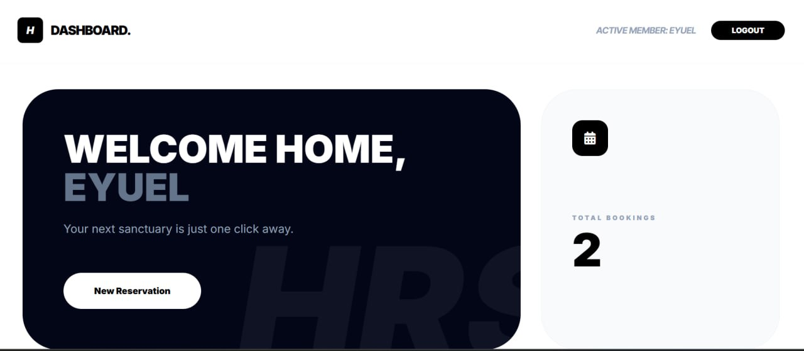
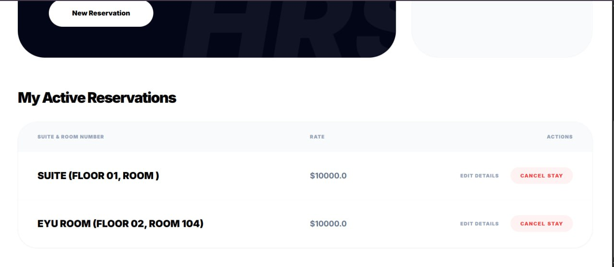
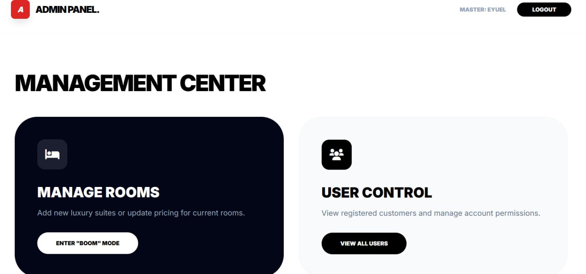
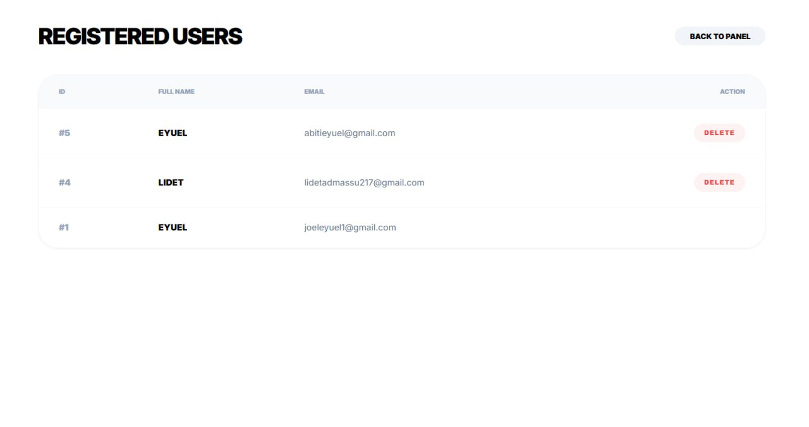
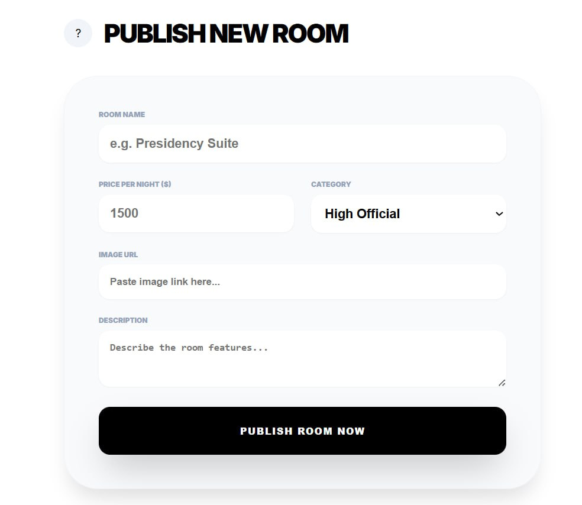

# Hotel Reservation System (HRS)

A comprehensive web-based hotel booking application built with Java Servlets, JSP, and HTML. This system allows users to register, login, browse available rooms, make reservations, and manage their bookings seamlessly. It also includes an admin panel for managing users, bookings, and rooms through full CRUD operations.

## Features

- **User Authentication**: Secure user registration and login system
- **Room Browsing**: View available hotel rooms with details (type, floor, room number, price)
- **Room Booking**: Easy-to-use booking interface for reserving rooms
- **Booking Management**: View, update, and cancel existing bookings
- **Dashboard**: Personalized user dashboard showing booking history and statistics
- **Admin Panel**: Complete CRUD operations for managing users, bookings, and rooms
- **Responsive Design**: Modern UI built with Tailwind CSS for optimal user experience
- **Database Integration**: MySQL database for persistent data storage

## Technologies Used

- **Backend**: Java 8, Jakarta EE 8 (Servlets, JSP)
- **Frontend**: HTML5, CSS3, JavaScript, Tailwind CSS
- **Database**: MySQL 8.0
- **Build Tool**: Apache Maven
- **IDE**: Apache NetBeans
- **Server**: Apache Tomcat
- **Version Control**: Git

## Prerequisites

Before running this application, make sure you have the following installed:

- Java Development Kit (JDK) 8 or higher
- Apache NetBeans IDE
- Apache Tomcat Server (configured in NetBeans)
- MySQL Server 8.0 or higher
- Git (for cloning the repository)

## Installation and Setup

### 1. Clone the Repository

```bash
git clone https://github.com/Joelorbit/Hotel-Reservation-System.git
cd Hotel-Reservation-System
```

### 2. Database Setup

1. Start your MySQL server
2. Create a new database named `hotel_db`
3. Import the database schema from `hotel_db.sql`:

```sql
mysql -u root -p hotel_db < hotel_db.sql
```

**Note**: Update the database credentials in the servlet files if your MySQL username/password differs from `root` / `Joelget@4`.

### 3. Open in NetBeans

1. Launch Apache NetBeans IDE
2. Go to **File > Open Project**
3. Navigate to the cloned repository folder and select it
4. Wait for NetBeans to load the Maven dependencies

### 4. Configure Tomcat Server

1. In NetBeans, go to **Tools > Servers**
2. Add Apache Tomcat server if not already configured
3. Set the server properties (port, etc.)

### 5. Run the Application

1. Right-click on the project in the Projects window
2. Select **Run** or press F6
3. NetBeans will build the project and deploy it to Tomcat
4. The application will open in your default browser at `http://localhost:8080/hotel`

## Usage

### User Registration

1. Navigate to the registration page
2. Fill in your details (name, email, password)
3. Click "Register" to create your account

### User Login

1. Go to the login page
2. Enter your email and password
3. Click "Login" to access your dashboard

### Booking a Room

1. From the dashboard, click on "View Rooms"
2. Browse available rooms and select one
3. Fill in booking details
4. Confirm your reservation

### Managing Bookings

1. View your bookings on the dashboard
2. Update booking details if needed
3. Cancel bookings directly from the dashboard

### Admin Operations

#### Admin Login

1. Use admin credentials to login (contact system administrator for credentials)
2. Access the admin dashboard

#### User Management (CRUD)

- **Create**: Add new users to the system
- **Read**: View all registered users and their details
- **Update**: Modify user information (name, email, etc.)
- **Delete**: Remove users from the system

#### Booking Management (CRUD)

- **Create**: Manually create bookings for users
- **Read**: View all bookings across the system
- **Update**: Modify booking details (dates, rooms, etc.)
- **Delete**: Cancel bookings on behalf of users

#### Room Management (CRUD)

- **Create**: Add new rooms to the hotel inventory
- **Read**: View all available rooms and their status
- **Update**: Modify room details (price, type, availability)
- **Delete**: Remove rooms from the system

## Project Structure

```
hotel/
├── src/
│   ├── main/
│   │   ├── java/
│   │   │   └── com/hrs/hotel/
│   │   │       ├── controller/     # Servlet controllers
│   │   │       ├── dao/           # Data Access Objects
│   │   │       ├── model/         # Java model classes
│   │   │       ├── resources/     # REST resources
│   │   │       └── util/          # Utility classes
│   │   ├── resources/
│   │   │   └── META-INF/
│   │   │       └── persistence.xml
│   │   └── webapp/                # Web resources
│   │       ├── *.jsp              # JSP pages
│   │       ├── *.html             # HTML pages
│   │       └── WEB-INF/
│   │           ├── web.xml
│   │           └── beans.xml
│   └── test/
│       └── java/
├── target/                        # Build output
├── pom.xml                        # Maven configuration
├── hotel_db.sql                   # Database schema
└── README.md
```

## Contributing

We welcome contributions to improve the Hotel Reservation System! Here's how you can contribute:

### 1. Fork the Repository

Click the "Fork" button at the top right of this repository.

### 2. Create a Feature Branch

```bash
git checkout -b feature/your-feature-name
```

### 3. Make Your Changes

- Follow the existing code style and conventions
- Add comments for complex logic
- Test your changes thoroughly

### 4. Commit Your Changes

```bash
git commit -m "Add: Brief description of your changes"
```

### 5. Push to Your Branch

```bash
git push origin feature/your-feature-name
```

### 6. Create a Pull Request

1. Go to the original repository
2. Click "New Pull Request"
3. Select your feature branch
4. Provide a clear description of your changes
5. Submit the pull request

### Development Guidelines

- **Code Style**: Follow Java naming conventions and keep code clean and readable
- **Testing**: Test all new features and bug fixes
- **Documentation**: Update this README if you add new features
- **Commits**: Use clear, descriptive commit messages

## Database Schema

The application uses a MySQL database with the following main tables:

- `users`: User account information
- `bookings`: Room reservation details

Refer to `hotel_db.sql` for the complete database schema.

## Troubleshooting

### Common Issues

1. **Database Connection Error**

   - Ensure MySQL server is running
   - Check database credentials in servlet files
   - Verify database name and table structure

2. **Tomcat Server Issues**

   - Check if Tomcat is properly configured in NetBeans
   - Ensure no port conflicts (default port 8080)

3. **Build Errors**
   - Clean and rebuild the project in NetBeans
   - Check Maven dependencies download

### Getting Help

If you encounter issues:

1. Check the NetBeans output window for error messages
2. Review the Tomcat logs
3. Ensure all prerequisites are installed correctly

## License

This project is licensed under the MIT License - see the [LICENSE](LICENSE) file for details.

## Screenshots

_Add screenshots of the application here_

- Login Page
  
- User Dashboard
  
- Room Booking Interface
  
- Booking Management
  
- Admin Dashboard
  
- User Management Panel
  
- Room Management
  

## Acknowledgments

- Built with Jakarta EE 8
- Styled with Tailwind CSS
- Icons from Font Awesome

## Contact

For questions or support, please open an issue on GitHub or contact the maintainers.

---

**Note**: This is a learning project demonstrating web development with Java Servlets and JSP. For production use, additional security measures and optimizations would be required.
