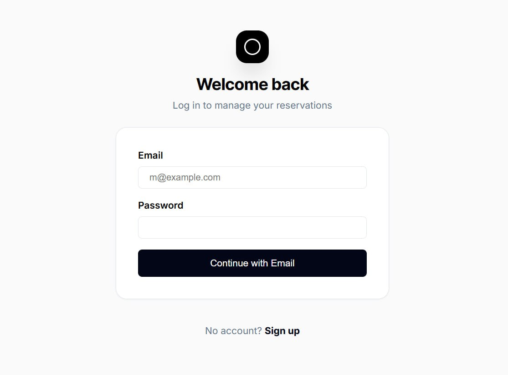
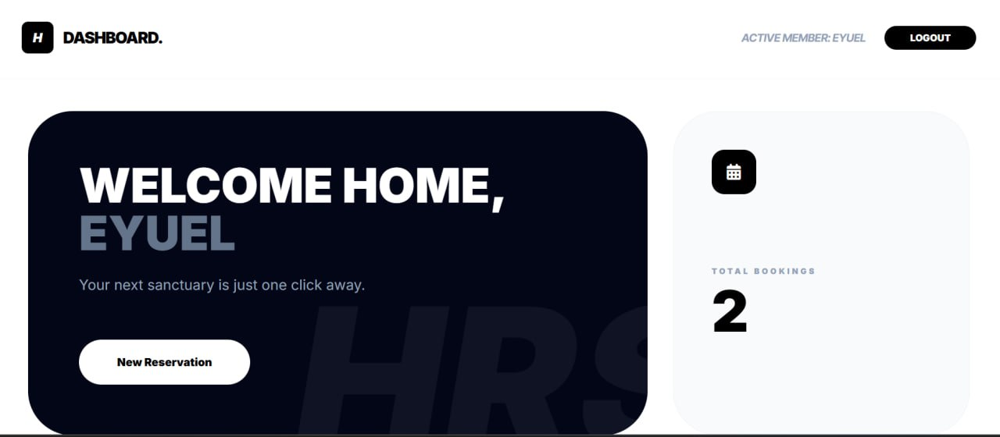
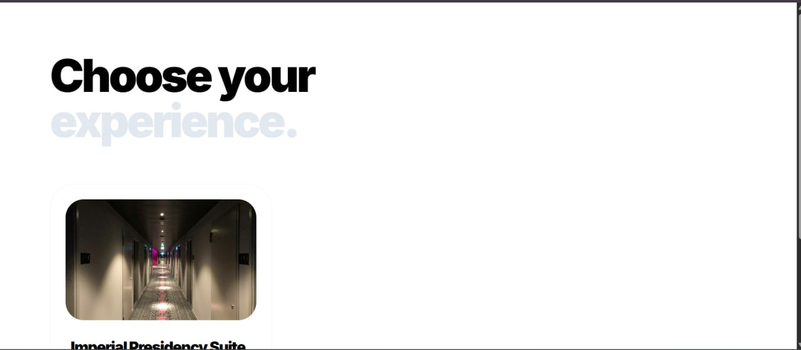
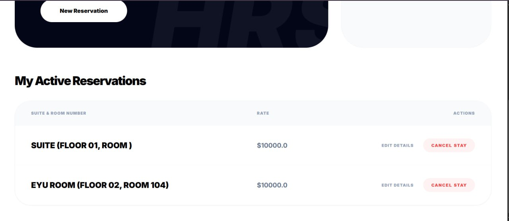
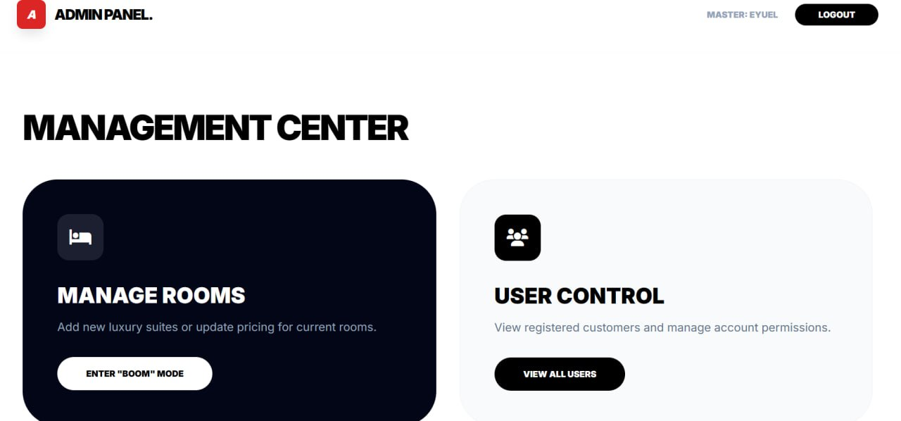
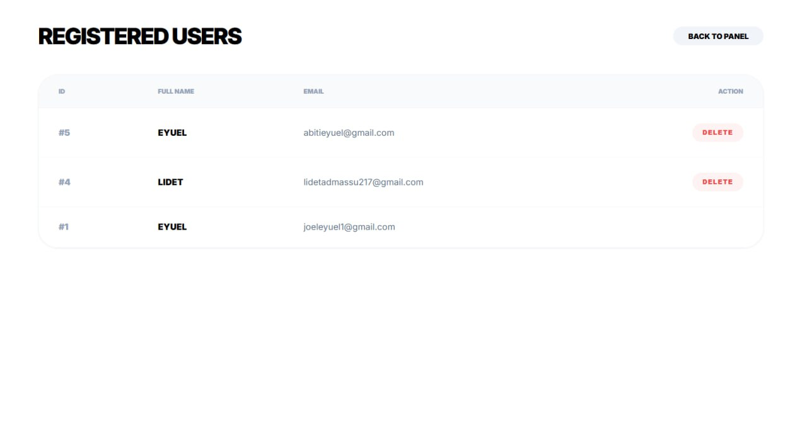
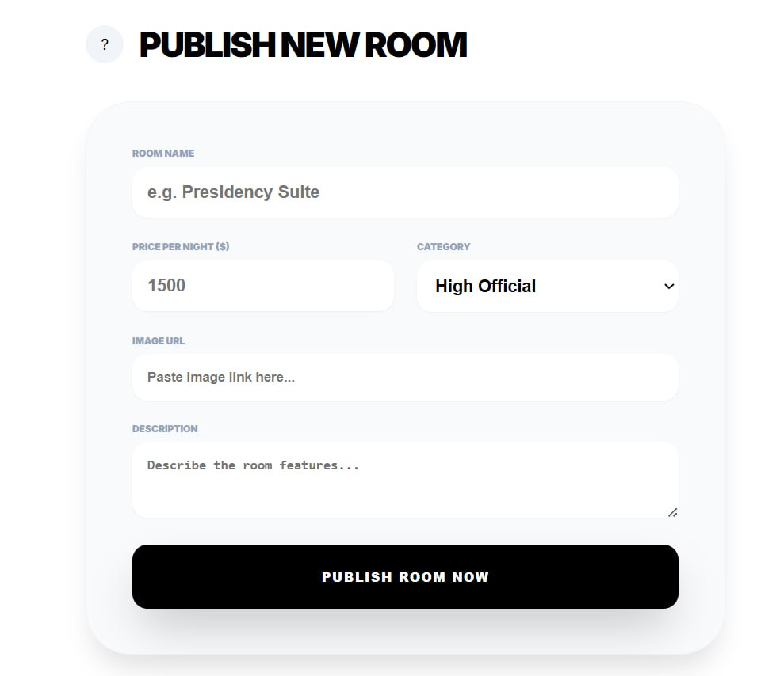

# Hotel Reservation System (HRS)

A comprehensive web-based hotel booking application built with **Java Servlets, JSP, and HTML**. The system allows users to register, log in, browse available rooms, make reservations, and manage their bookings. It also includes a full-featured **admin panel** for managing users, bookings, and rooms.

---

## 📌 Table of Contents

* [Features](#features)
* [Screenshots](#screenshots)
* [Technologies Used](#technologies-used)
* [Prerequisites](#prerequisites)
* [Installation & Setup](#installation--setup)
* [Usage](#usage)

  * [User Registration](#user-registration)
  * [User Login](#user-login)
  * [Booking a Room](#booking-a-room)
  * [Managing Bookings](#managing-bookings)
* [Admin Panel](#admin-panel)
* [Project Structure](#project-structure)
* [Database Schema](#database-schema)
* [Troubleshooting](#troubleshooting)
* [License](#license)
* [Contact](#contact)

---

## Features

* Secure user authentication (registration & login)
* Browse hotel rooms with detailed information
* Room reservation and booking management
* Personalized user dashboard
* Admin panel with full CRUD operations
* Responsive UI built with Tailwind CSS
* MySQL database integration

---

## Screenshots

> Click any item below to jump directly to the screenshot.

* [Login Page](#login-page)
* [User Dashboard](#user-dashboard)
* [Room Booking Interface](#room-booking-interface)
* [Booking Management](#booking-management)
* [Admin Dashboard](#admin-dashboard)
* [User Management](#user-management)
* [Room Management](#room-management)

---

## Technologies Used

* **Backend**: Java 8, Jakarta EE 8 (Servlets, JSP)
* **Frontend**: HTML5, CSS3, JavaScript, Tailwind CSS
* **Database**: MySQL 8.0
* **Build Tool**: Apache Maven
* **IDE**: Apache NetBeans
* **Server**: Apache Tomcat
* **Version Control**: Git

---

## Prerequisites

Ensure the following are installed:

* JDK 8 or higher
* Apache NetBeans IDE
* Apache Tomcat (configured in NetBeans)
* MySQL Server 8.0+
* Git

---

## Installation & Setup

### 1. Clone the Repository

```bash
git clone https://github.com/Joelorbit/Hotel-Reservation-System.git
cd Hotel-Reservation-System
```

### 2. Database Setup

1. Start MySQL server
2. Create database:

```sql
CREATE DATABASE hotel_db;
```

3. Import schema:

```bash
mysql -u root -p hotel_db < hotel_db.sql
```

> Update database credentials in servlet configuration files if needed.

### 3. Open in NetBeans

* File → Open Project
* Select the cloned folder
* Allow Maven dependencies to load

### 4. Configure Tomcat

* Tools → Servers
* Add Apache Tomcat
* Configure port (default: 8080)

### 5. Run the Application

* Right-click project → Run (F6)
* Access at: `http://localhost:8080/hotel`

---

## Usage

### User Registration

1. Navigate to the registration page
2. Enter name, email, and password
3. Submit the form

### User Login

1. Open login page
2. Enter credentials
3. Access dashboard

### Booking a Room

1. Click **View Rooms**
2. Select an available room
3. Enter booking details
4. Confirm reservation

### Managing Bookings

* View active reservations
* Update booking details
* Cancel bookings

---

## Admin Panel

### Admin Login

* Use admin credentials to log in
* Access admin dashboard

### Admin Capabilities

* **User Management**: Create, view, update, delete users
* **Booking Management**: Full CRUD for reservations
* **Room Management**: Manage room inventory and pricing

---

## Project Structure

```text
hotel/
├── src/
│   └── main/
│       ├── java/com/hrs/hotel/
│       │   ├── controller/
│       │   ├── dao/
│       │   ├── model/
│       │   └── util/
│       └── webapp/
│           ├── *.jsp
│           └── WEB-INF/
├── pom.xml
├── hotel_db.sql
└── README.md
```

---

## Database Schema

Main tables:

* `users`
* `bookings`
* `rooms`

Refer to **hotel_db.sql** for full schema.

---

## Troubleshooting

### Common Issues

* **Database connection errors**: verify credentials and MySQL status
* **Tomcat issues**: check port conflicts and server configuration
* **Build failures**: clean and rebuild Maven project

---

## Screenshots Gallery

### Login Page



### User Dashboard



### Room Booking Interface



### Booking Management



### Admin Dashboard



### User Management



### Room Management



---

## License

Licensed under the **MIT License**. See `LICENSE` for details.

---

## Contact

For questions or issues, please open a GitHub issue or contact the project maintainers.

> **Note**: This is a learning project. Additional security and performance enhancements are required for production use.
